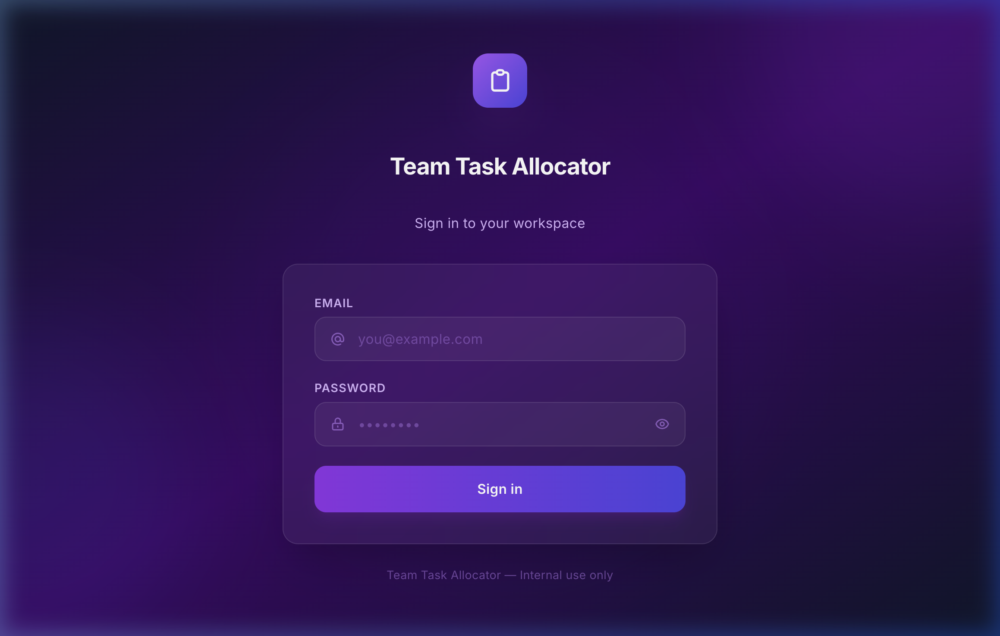
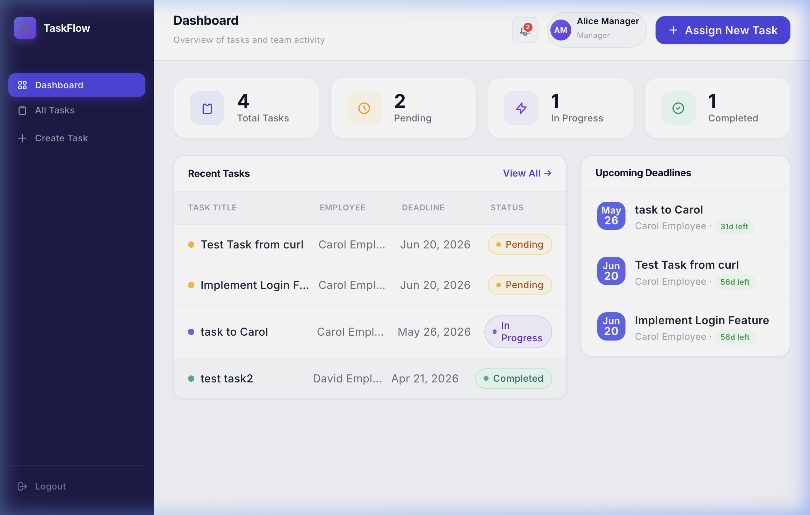
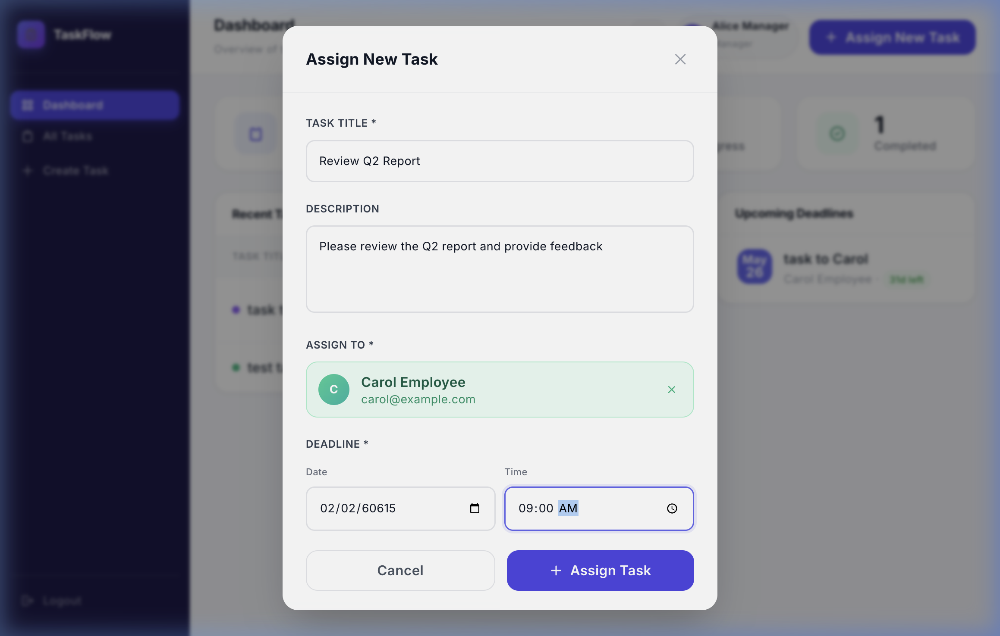
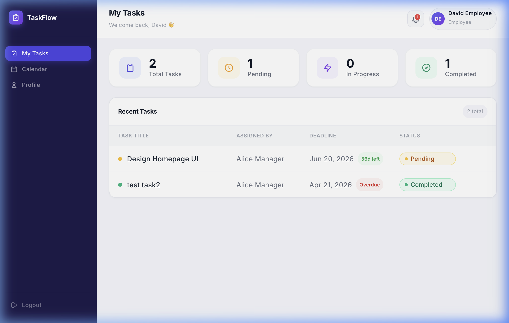
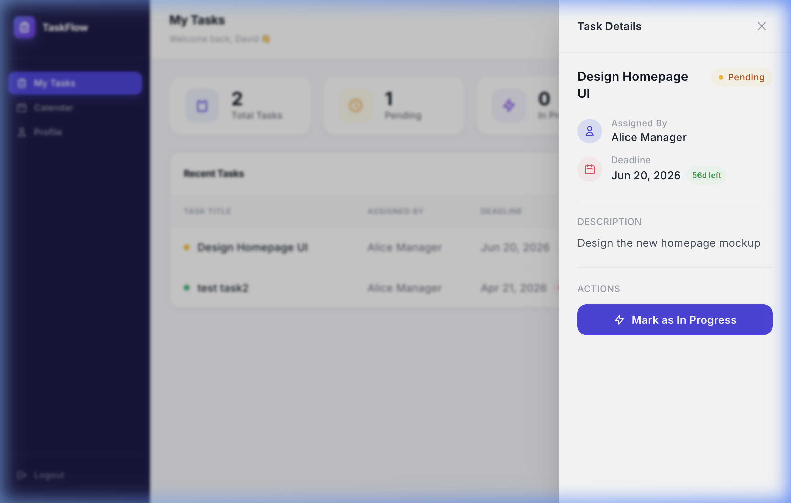

# Team Task Allocator

A full-stack task management system where **managers** assign tasks to employees and **employees** track their work — all in a clean, modern **TaskFlow** light-theme UI.

Built with React + TypeScript on the frontend and ASP.NET Core (.NET 9) on the backend, backed by PostgreSQL and secured with JWT authentication.

---

## Screenshots

### Login


### Manager Portal — Dashboard


### Manager Portal — Assign New Task


### Employee Portal — My Tasks


### Employee Portal — Task Detail


---

## Stack

| Layer | Technology |
|---|---|
| Frontend | React 19 + TypeScript, Vite, CSS (custom `tf-` design system), Axios, Inter (Google Fonts) |
| Backend | ASP.NET Core (.NET 9) Web API (C#) |
| Database | PostgreSQL 15+ with Entity Framework Core (Npgsql) |
| Auth | JWT — role-based (`manager` / `employee`), 24-hour expiry |
| Testing | Vitest + React Testing Library (27 tests, all passing) |

Vite dev server proxies `/api` to the .NET backend — same origin, no CORS needed.

---

## Project Structure

```
/
├── frontend/               # React TypeScript app
│   └── src/
│       ├── api/            # Axios client + API functions (tasks, users, auth)
│       ├── components/     # EmployeeSearch, TaskDetailPanel, ProtectedRoute
│       ├── context/        # AuthContext (JWT state + logout)
│       ├── pages/          # Login, ManagerDashboard, EmployeeDashboard
│       └── types/          # TypeScript interfaces (Task, User, Auth)
├── backend/                # ASP.NET Core Web API
│   ├── Controllers/        # AuthController, TasksController, UsersController
│   ├── Services/           # AuthService, TaskService, UserService
│   ├── Repositories/       # IUserRepository, ITaskRepository + EF implementations
│   ├── Models/             # EF Core entities (User, TaskEntity)
│   ├── DTOs/               # Request / response shapes
│   └── Migrations/         # EF Core migrations
└── docs/
    ├── screenshots/        # UI screenshots used in this README
    └── adr/                # Architecture Decision Records
```

---

## Prerequisites

- [.NET 9 SDK](https://dotnet.microsoft.com/download)
- [Node.js 20+](https://nodejs.org/)
- PostgreSQL 15+ with `pg_trgm` extension

---

## Getting Started

### 1. Database setup

```bash
psql -U postgres -c "CREATE DATABASE teamtaskallocator;"
psql -U postgres -d teamtaskallocator -c "CREATE EXTENSION IF NOT EXISTS pg_trgm;"
```

### 2. Backend configuration

Edit `backend/appsettings.Development.json` with your local values:

```json
{
  "ConnectionStrings": {
    "DefaultConnection": "Host=localhost;Port=5432;Database=teamtaskallocator;Username=postgres;Password=yourpassword"
  },
  "Jwt": {
    "Secret": "your-32-char-minimum-secret-here",
    "Issuer": "TeamTaskAllocator",
    "Audience": "TeamTaskAllocatorUsers"
  }
}
```

> Never commit real secrets to source control. `appsettings.Development.json` is git-ignored.

### 3. Run migrations & seed data

```bash
cd backend
dotnet ef database update
```

Seed users are created automatically on first run:

| ID | Name | Email | Password | Role |
|---|---|---|---|---|
| 1 | Alice Manager | alice.manager@example.com | password123 | manager |
| 2 | Bob Manager | bob.manager@example.com | password123 | manager |
| 3 | Carol Employee | carol@example.com | password123 | employee |
| 4 | David Employee | david@example.com | password123 | employee |
| 5 | Eve Employee | eve@example.com | password123 | employee |

### 4. Start the backend

```bash
dotnet run --project backend/TeamTaskAllocator.csproj
```

The API listens on `http://localhost:5113`.

### 5. Start the frontend

```bash
cd frontend
npm install
npm run dev
```

App is available at `http://localhost:5173`.

---

## Running Tests

```bash
cd frontend
npm test
```

27 tests across 9 suites — all passing:

| Suite | Tests |
|---|---|
| Rendering | 6 |
| Logout | 1 |
| Modal open/close | 4 |
| Employee search | 2 |
| Form validation | 2 |
| Deadline date/time combination | 2 |
| Happy path task creation | 3 |
| API error handling | 4 |
| All Tasks view | 3 |

---

## UI Design

Both portals share the **TaskFlow** design system — a clean light-theme with a deep-indigo sidebar:

| Page | Highlights |
|---|---|
| **Login** | Full-screen purple/indigo gradient, glassmorphic card, icon-prefixed inputs |
| **Manager Dashboard** | Stats row (total / pending / in progress / completed), two-column layout (recent tasks + upcoming deadlines), modal-based task creation |
| **Assign Task Modal** | Employee live-search with avatar chips, split date + time pickers, inline validation |
| **Employee Dashboard** | Personalised greeting, task list with deadline countdown badges (overdue / Nd left), stats cards |
| **Task Detail Slideover** | Right-hand panel with full task info, one-click status update (Pending → In Progress → Completed) |

Design tokens: deep-indigo sidebar (`#1e1b4b`), white content area, indigo-600 accent, Inter typography.

---

## Roles & Capabilities

| Role | Capabilities |
|---|---|
| `manager` | Create tasks, assign to employees (search by name), view all created tasks, see upcoming deadlines |
| `employee` | View own assigned tasks, update task status (Pending → In Progress → Completed), view task details |

---

## API Routes

All routes prefixed with `/api`.

| Method | Path | Role | Description |
|---|---|---|---|
| POST | `/api/auth/login` | Public | Authenticate and receive a JWT |
| GET | `/api/auth/me` | Any | Return current user info from JWT |
| GET | `/api/users/search?q=` | manager | Search employees by name |
| POST | `/api/tasks` | manager | Create and assign a task |
| GET | `/api/tasks` | manager | List all tasks created by the manager |
| GET | `/api/tasks/my` | employee | List tasks assigned to the employee |
| PATCH | `/api/tasks/{id}/status` | employee | Update task status |

---

## Architecture Decisions

Key decisions documented as ADRs in [docs/adr/](docs/adr/):

- [ADR 001](docs/adr/001-database-schema.md) — Skills storage (`TEXT[]` + GIN index), employee search strategy, repository pattern, JWT auth

---

## V1 Scope

**In scope:** task creation, employee assignment, task list view, task detail slideover, status updates (Pending / In Progress / Completed), deadline tracking with countdown badges.

**Out of scope for V1:** email alerts, calendar view, workload balancing, auto-assignment, task comments/attachments, mobile-optimised layout.
